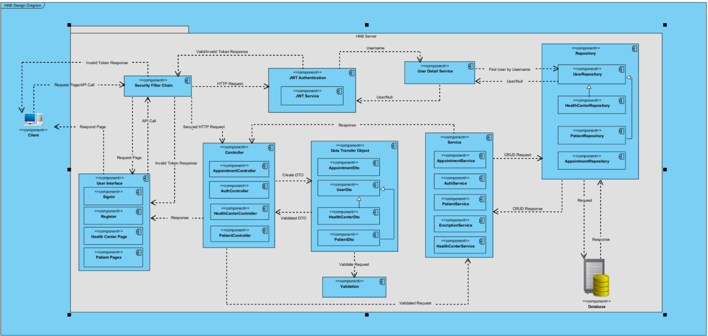

# HAB Healthcare Appointment Booking System

HAB is a healthcare startup that specializes in providing online healthcare appointment booking services. The web-based system helps patients schedule and manage appointments by navigating available dates. This project is developed as part of the Secure Design and Development module (7032CEM) at Coventry University for the Master's degree.

## Table of Contents

- [Features](#features)
- [Security](#security)
- [Component Diagram](#component-diagram)
- [Technologies Used](#technologies-used)
- [Contact](#contact)
- [Deployment](#deployment)

## Features

The prototype maintains the following functionality:

- **User Registration and Login:**
    - Users can create an account and log in securely.

- **Appointment Scheduling:**
    - Patients can book appointments with available healthcare providers.

- **Healthcare Provider Dashboard:**
    - Healthcare providers have a dashboard to manage their appointments and availability.
    - They can view and accept or reject appointment requests.

- **Patient Health Records:**
    - Healthcare providers can access and update patient health records with patient consent.
    - Patients can view their own health records.

- **Prescriptions:**
    - Users and health centers can view prescriptions.

## Security

The application implements robust security measures using Spring Boot Security:

- Authentication is performed per API, ensuring that each API call is checked for proper authentication.
- JSON Web Token (JWT) is utilized for user authentication, governed by cryptography.
- JWTs are stored in cookies, and each API call requires a valid JWT.

## Component Diagram

*Component Diagram shows how application works when the client creates an HTTP 
request towards the server. This request can be REST Api or page request. 
Based on figure 1 the application authenticates each request which comes 
from a client. Firstly, “Security Filter Chain” component checks whether 
the request needs to be authenticated or not. If it is a page request 
and does not need to be authenticated it goes to “User Interface” 
component. If it is a REST Api request and does not need to be 
authenticated it goes to controller component. Finally, if it is REST 
Api request and needs to be authenticated it will be authenticated by 
“JWT Authentication” component.*

## Technologies Used

- **Backend:**
    - Spring Boot for the server-side application.
    - Spring Boot Security for authentication.
    - Java for backend logic.
    - Verification and Validation of inputs in server side.

- **Frontend:**
    - HTML and CSS for the user interface.
    - JavaScript for making API calls and handling frontend logic.
    - Verification and Validation of inputs in frontend.

- **Testing:**
    - Selenium for automated testing.

## Contact

For any inquiries, please contact Radman Lotfiazar at radman.lotfiazar@gmail.com.

# Deployment

Deployment by Azure:
https://habsecurity.azurewebsites.net/index.html
